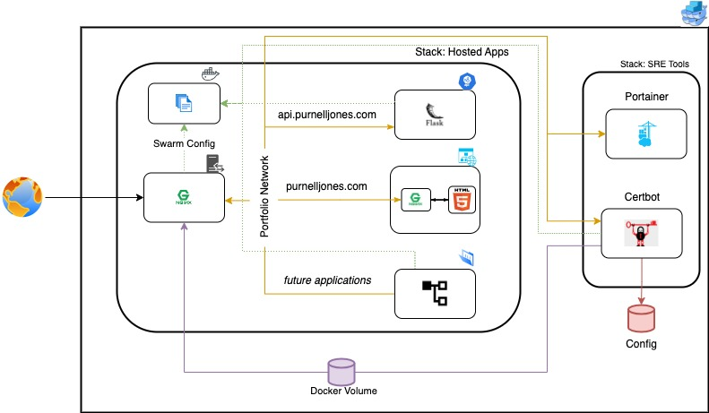

# Web Portfolio

This GitHub Organization has been created to organize and share my web portfolio and relevant applications using a microservice architecture with Docker Swarm.

## Table of Contents
- [Design](#design)
- [Features](#features)
- [Prerequisites](#prerequisites)
- [Installation](#installation)
- [Running Application](#running-application)
- [Usage](#usage)
- [Contact](#contact)

# Design



This architecture is designed to accept requests through an Nginx reverse proxy that routes all requests through a shared Docker Swarm network. The reverse proxy utilizes TLS certificates for all domains from an internal service using a private network used by the service and the API Gateway.For application maintainability, the architecture is equipped with an integrated instance of Portainer.

## Features
- Microservice architecture using Docker Swarm
- Secure communication with TLS certificates
- Centralized management with Portainer
- Scalable and maintainable setup

## Prerequisites
- Docker
- Docker Swarm

## Installation
1. Navigate to you projects directory
    ```bash
    $ cd /your/project/directory
    ```

2. Download setup script
    ```bash
    curl -L -o setup.sh https://raw.githubusercontent.com/jonepl-portfolio/.github/main/shared-files/setup.sh
    ```

3. Run setup script
    ```bash
    . setup.sh
    ```

## Running Application
1. Build the mock server image
    ```bash
    $ make build-server
    ```
2. Start the mock service
    ```bash
    $ make start-server
    ```
3. Access endpoints
    ```bash
    $ curl https://localhost
    ```
4. destroy mock server
    ```bash
    $ make destroy-server
    ```

## Usage
- Access the web portfolio at `https://yourdomain.com`
- Access Portainer at `https://yourdomain.com/portainer`
- APIs are accessible via subdomains (e.g., `https://api.yourdomain.com`)

## Contact
For questions or support, please contact [plj.coding@gmail.com](mailto:plj.coding@gmail).