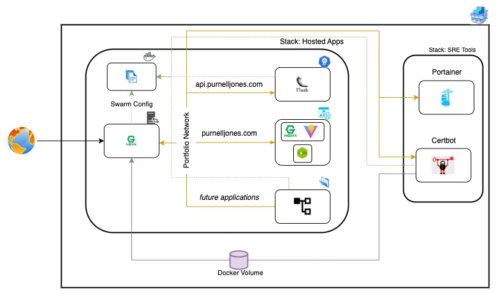

# Web Portfolio

Welcome to my web portfolio! This GitHub Organization showcases my work and technical expertise through a microservice architecture implemented using Docker Swarm.

## Table of Contents
- [Overview](#overview)
- [Features](#features)
- [Design](#design)
- [Features](#features)
- [For Developers](#for-developers)
- [Contact](#contact)

# Overview

This portfolio demonstrates a microservice-based architecture built for scalability, maintainability, and security. It uses an NGINX reverse proxy to route requests to subdomain-based APIs and services, secured with TLS certificates generated internally.

The architecture includes an integrated Portainer instance for centralized management, making it easier to monitor and control the Docker Swarm stack.

# Features
* Microservice Architecture: Scalable and modular design with multiple services interacting through a shared network.
* Secure Communication: TLS encryption for all domains.
* Centralized Management: Portainer integration for efficient service monitoring.
* Subdomain Routing: APIs and services accessible through unique subdomains.

# Design

Requests are routed through an NGINX reverse proxy using a private Docker Swarm network. This ensures secure and efficient communication between services. TLS certificates are automatically managed by an internal Certbot service, enhancing the security of all endpoints.

## For Developers

If you'd like to explore or reproduce this setup, see the [Installation Guide](./INSTALL.md).

## Contact
For questions or support, please contact [plj.coding@gmail.com](mailto:plj.coding@gmail).